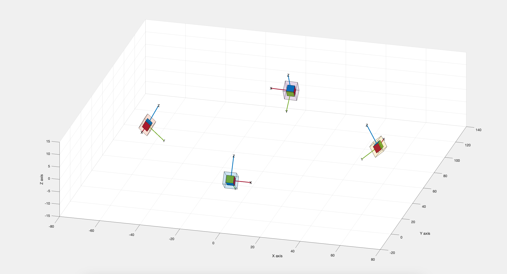

# Surgical_Instrument_Tracking_CS
Our GitHub repository hosts a tool designed for tracking color-coded surgical instruments and performing 3D pose estimation. Built to meet the demands of modern microsurgical environments, this tool seamlessly integrates with quad-cam camera setups, processing four input videos simultaneously.

## System description
For our project, we are using the Arducam 1MP*4 Quadrascopic Camera Bundle Kit paired with the Nvidia Jetson Nano. The four cameras are mounted on stands with a tilt of 40º around the camera's x-axis.

We designed and integrated a custom case and lighting system for protection and reliability purposes. Also, we integrated a dome to be placed on top of the cameras to make color detection more stable.

## Calibration
Proper calibration is crucial for accurate 3D pose estimation. After experimenting with various methods using OpenCV without obtaining good results, we found success with Matlab's calibration tool. Here's our approach:

1. **Mono Calibration:** Each individual camera undergoes mono calibration to obtain intrinsic parameters.
2. **Stereo Calibration:** Using Matlab's stereo calibration tool, we estimate the pose of each camera pair in the camera_0 coordinate frame.
3. **Camera_3 Position Estimation:** Due to challenges in synchronizing images, we algebraically derived the transformation for camera_3 using stereo pairs 1-3 and 2-3.

The complete calibration dataset and results can be found in the following folders:

- [dataset1](link_to_dataset1_folder)
- [calibration](calibraton)

Additionally, we provide a sample code snippet for plotting the calibration results.

